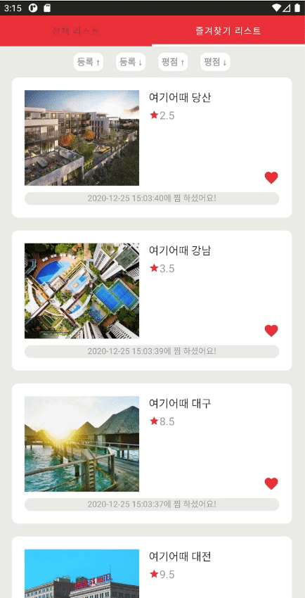
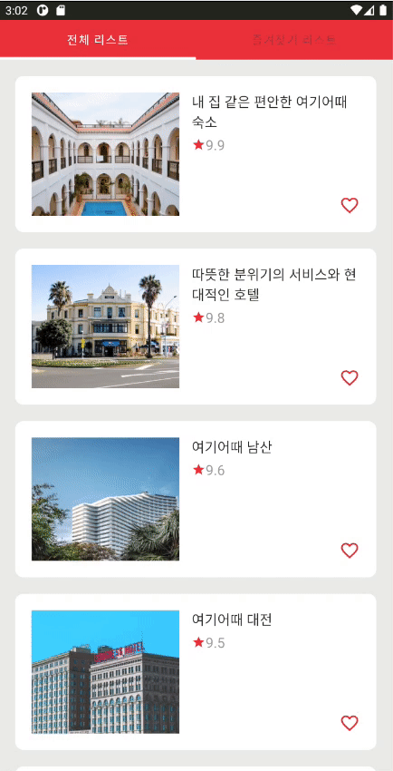
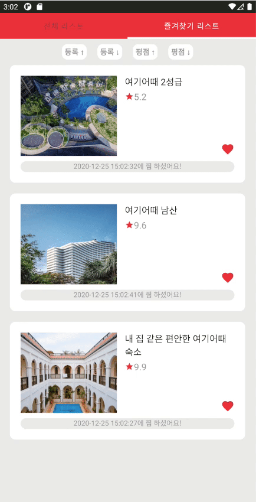
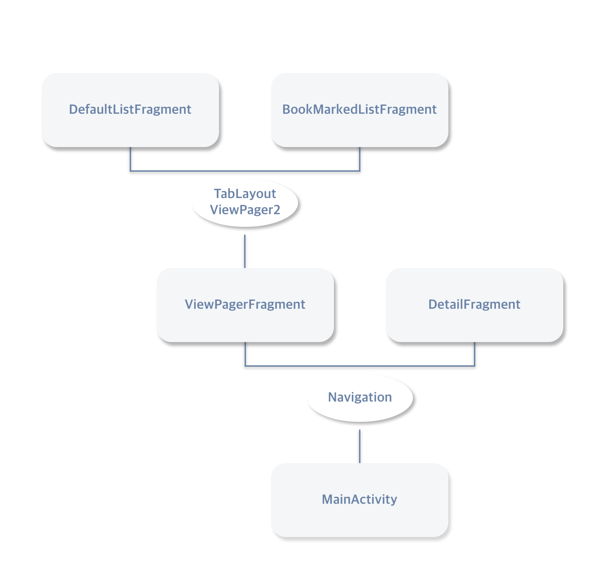
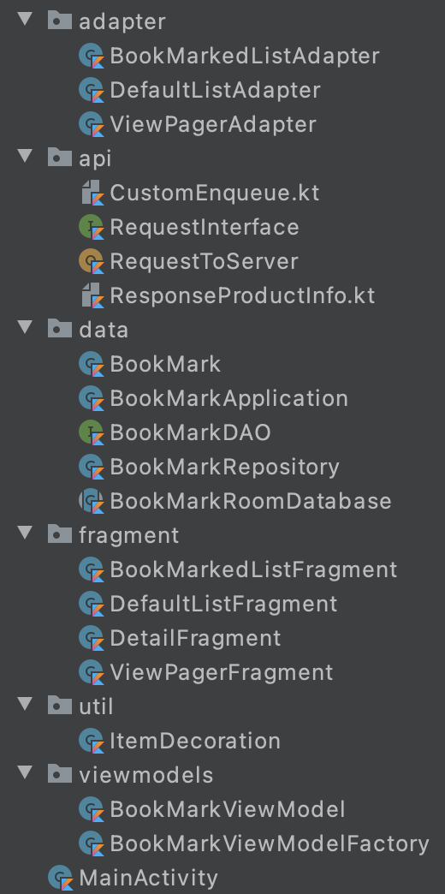

# BookMarkExample
즐겨찾기 기능을 완벽히 구현해보자 ! 

많은 어플에서 등장하는 즐겨찾기 기능을 구현한 앱으로,  MVVM과 Room을 사용하여 개발하였다. 

Android Jetpack을 적극적으로 사용하였으며, 이는 여름부터 공부해오던 Sunflower 예제를 참고하였다. 

# BookMarkExample 프로젝트 소개

### 개발 기간 2020.12.21- 2020.12.24

### 개발자 [sery270](https://github.com/sery270) 

## 기능 소개

Paging           |  Detailed View           |  Sorting
:-------------------------:|:-------------------------:|:-------------------------:
  |    |    

Registering BookMark           |  Unregistering BookMark          |  Saving to Internal Storage
:-------------------------:|:-------------------------:|:-------------------------:
  |    |    

# BookMarkExample 프로젝트 개발환경

## Kotlin 1.3.72

## Android Studio 4.1

## App Architecture

### UI
 

### Data
 

> references

[Sunflower 스터디](https://github.com/sery270/sunflower_clone)

[Android App Architecture](https://developer.android.com/jetpack/guide) base on MVVM

[Android Room with a View - Kotlin](https://developer.android.com/codelabs/android-room-with-a-view-kotlin?hl=ko#14)

## Library

### Jetpack

UI
- Navigation
- ViewPager2
- RecyclerView
- Constraint/LinearLayout
- fragment

DATA
- Room

### Kotlin

Android KTX
- Coroutine
- MVVM Pattern
    - ViewModel
    - LiveData

### Server

- Retrofit2

### etc

- Glide

# BookMarkExample 프로젝트 conventions

## Coding conventions

[BookMarkExample 프로젝트 Coding conventions](./Docs/Coding_Convention.md)

## Git conventions

> [Add Codes] - 새로운 코드를 추가했을 경우

> [Refactor Codes] - 기존에 작성한 코드를 수정했을 경우

> [Implement Features] - 새로운 기능을 추가하거나 완성했을 경우

> [Fix Bugs] - 오류를 해결했을 경우

> [Docs] - readme, wiki 작성한 경우

> [Create UI] - 새로운 xml 파일을 생성했을 경우

> [Chore] - 동작에 영향을 주는 코드 변경 없는 변경사항 (주석, 정렬 등등)

## Foldering

 

# 마무리

### 보완할 점

- Data Binding 적용하기

- DetailFragment inflate할 때도 viewmodel 활용하기

- RecyclerView 로딩할 때, 로딩 처리 및 아이템 등장 애니메이션 넣기
